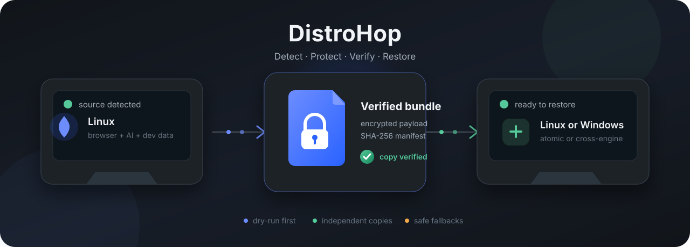

<p align="center">
  
</p>

<p align="center">
  <a href="#en"><b>English</b></a> · <a href="#pt">Português</a>
</p>

<a id="en"></a>

<h1 align="center">DistroHop</h1>

<p align="center">
  Move browser profiles, AI tool accounts, and developer data safely.<br>
  One app for Linux distributions and Windows, with verified backup and restore.
</p>

<p align="center">
  <a href="https://github.com/lirenzzzin/distrohop/actions/workflows/tests.yml"></a>
  
  
  <a href="LICENSE"></a>
</p>

> [!WARNING]
> DistroHop is alpha software that handles browser sessions, passwords, keys,
> and partition tables. Start with `--dry-run`, keep an independent backup, and
> read the [security model](SECURITY.md) before using real data. The vault
> feature is Linux-only and must never be your only copy.

## What you get

| Discover | Protect | Restore |
| --- | --- | --- |
| Finds the current OS, distro family, browsers, AI tools, developer data, packages, and safe destination disks. | Creates a checksummed bundle, optionally encrypted, and verifies every copy before publishing it. | Restores same-engine profiles atomically or converts portable data between Chromium and Firefox engines. |

DistroHop currently understands:

- Brave, Chrome, Chromium, Edge, Firefox, and Zen profiles;
- Claude, Codex, Gemini, and Kimi account/configuration directories;
- SSH, GPG, selected dotfiles, and installed-package inventories;
- 20 Linux platform strategies, including traditional, atomic, immutable, and
  declarative systems; and
- Windows browser paths, DPAPI-protected Chromium data, WinGet, Defender, and
  secondary volumes.

An unknown Linux distribution is not a fatal error. DistroHop detects
capabilities and uses a conservative Flatpak/manual fallback instead of
guessing a destructive package-manager command.

## Quick start

### 1. Check the requirements

- Python **3.9 or newer** with Tk for the graphical interface;
- Linux: `lsblk`/util-linux and OpenSSL;
- optional on Linux: NSS for Firefox/Zen passwords and Secret Service or
  KWallet access for newer Chromium secrets; and
- Windows: the official Python distribution with Tk and PowerShell.

No third-party Python package is required.

### 2. Clone and inspect the machine

```bash
git clone https://github.com/lirenzzzin/distrohop.git
cd distrohop
./bin/distrohop list
./bin/distrohop backup --dry-run
```

`list` shows what DistroHop recognized. The backup dry run enumerates every
planned read and write without creating a file.

### 3. Open the graphical app

```bash
./bin/distrohop
```

The dependency-free Tk interface includes persistent light/dark themes, a
complete Portuguese/English toggle, animated progress, a collapsible sidebar,
backup and restore wizards, and the guarded vault planner. In the destination
screen, select a folder and use **Create subfolder…** to create and select a
private backup directory inside it. To force a mode:

```bash
./bin/distrohop --gui
./bin/distrohop --cli list
```

On Windows, extract or clone the folder and double-click `distrohop.bat`, or
use:

```bat
distrohop.bat --cli list
distrohop.bat --cli backup --dry-run
```

The Windows launcher never disables Defender. With explicit consent and a UAC
prompt, it can request an exclusion for the exact DistroHop folder only.

### 4. Create a verified backup

```bash
# One destination
./bin/distrohop backup --target /run/media/user/BACKUP

# Two independently verified copies, encrypted with a prompted password
./bin/distrohop backup \
  --target /mnt/drive-one \
  --target /mnt/drive-two \
  --encrypt
```

A real backup never overwrites an existing bundle. Open bundles use private
file permissions, but their contents remain readable to anyone with disk
access; use `--encrypt` for sensitive data. Passwords are prompted without echo
or read from a private `--password-file`—never from a command-line argument.

### 5. Restore on the destination

Always inspect the plan first:

```bash
./bin/distrohop restore /media/user/BACKUP/distrohop-my-pc-DATE --dry-run
./bin/distrohop restore /media/user/BACKUP/distrohop-my-pc-DATE
```

For a different browser engine:

```bash
./bin/distrohop restore /path/to/bundle \
  --browser brave \
  --target-browser firefox \
  --dry-run
```

DistroHop checks every file and refuses to modify a profile while its browser
is running. The previous profile is preserved beside the replacement with a
`.distrohop-before-*` suffix.

Cookies and bookmarks can cross browser engines. Passwords are exported to
`distrohop-logins.csv` for manual import because Chromium and Firefox vaults
are not interchangeable. Some sessions and device-bound credentials require a
new login by design.

### 6. Plan a Linux vault partition

```bash
./bin/distrohop vault create \
  --disk /dev/sdX \
  --size-gib 32 \
  --backup /media/other-disk/distrohop-bundle \
  --dry-run
```

Execution additionally requires `--execute`, root, a long confirmation phrase,
and a second verified bundle on another disk. The planner accepts GPT free
space or a tightly constrained shrink of the final single-device Btrfs
partition. It refuses Ext4/XFS shrinking, unsafe Btrfs states, insufficient
margin, system-disk ambiguity, and stale plans. It never edits the bootloader
or `fstab`.

Read the complete [vault safety contract](docs/VAULT.md) before considering
`--execute`.

## How it stays safe

- SQLite databases are copied through consistent snapshots, including WAL
  contents.
- Every bundle has a manifest and SHA-256 checksums.
- Each destination is written to a temporary directory, reread, verified, and
  atomically renamed.
- The working copy is created inside the selected destination with the most
  free space, never in `/tmp`; capacity is checked before the first copy.
- Restore verifies first and keeps the previous profile.
- Passwords never appear in process arguments or resume-state files.
- NixOS and Guix receive declarative instructions instead of imperative
  package changes.
- rpm-ostree and transactional-update systems require a new boot before
  resuming.
- The partition vault defaults to read-only planning and revalidates disk
  sectors immediately before formatting.

## Linux compatibility

| Strategy | Families and examples |
| --- | --- |
| APT | Debian, Ubuntu, Mint, Pop!_OS, elementary, Zorin, Kali, MX, Deepin |
| pacman | Arch, CachyOS, Manjaro, EndeavourOS, Garuda, Artix, KaOS |
| DNF/RPM | Fedora, RHEL, CentOS, Rocky, AlmaLinux, Oracle Linux, Nobara |
| Zypper | openSUSE Leap, Tumbleweed, Slowroll, SLES, SLED |
| Other native | Alpine, Void, Gentoo, Solus, Clear Linux, Slackware, Mageia, PCLinuxOS |
| Atomic/immutable | Silverblue, Kinoite, Bazzite, Bluefin, Aurora, CoreOS, MicroOS, Aeon, Kalpa, Vanilla OS, SteamOS, Endless OS |
| Declarative | NixOS, GNU Guix, blendOS |
| Unknown distro | capability detection, then safe Flatpak/manual guidance |

See the exact detection and package behavior in
[Linux compatibility](docs/LINUX-COMPATIBILITY.md).

## Documentation

| Guide | Use it when… |
| --- | --- |
| [Linux compatibility](docs/LINUX-COMPATIBILITY.md) | you need the distro matrix, detection rules, or atomic/declarative behavior |
| [Windows support](docs/WINDOWS.md) | you need DPAPI, Defender, WinGet, browser, or volume details |
| [Vault partition](docs/VAULT.md) | you are reviewing partition safety gates |
| [GUI design](docs/GUI-DESIGN.md) | you want the interface language and animation model |
| [Security policy](SECURITY.md) | you found a vulnerability or need the threat boundaries |
| [Technical specification](SPEC.md) | you want the complete behavior and architecture contract |

## Development and validation

```bash
python3 -m unittest discover -v
python3 -m compileall -q distrohop tests
python3 -m pip install --no-deps .
```

The test suite covers detection, capture, bundles, cryptography, atomic
restore, cross-engine conversion, GUI behavior, NixOS/atomic flows, Windows
fixtures, and the vault planner. AES-GCM is checked against NIST vectors.

The project is tested in CI on Linux and Windows. A physical Windows smoke test,
release signing, and reputation checks are still required before distributing
trusted Windows executables.

## Security

Do not attach real bundles, profiles, cookies, `Local State`, keys, tokens, or
disk images to a public issue. Report vulnerabilities privately through
**Security → Advisories → New draft security advisory** in this repository.

## License and credit

Created by **Lina** and licensed under the
[Apache License 2.0](LICENSE). You may use, modify, and distribute DistroHop,
including commercially, under the license terms.

DistroHop is independent and is not affiliated with any Linux distribution,
browser vendor, AI provider, Microsoft, or the projects mentioned in its
documentation.

<br>

---

<a id="pt"></a>

<p align="center">
  <a href="#en">English</a> · <b>Português</b>
</p>

<h1 align="center">DistroHop</h1>

<p align="center">
  Migre perfis de navegador, contas de ferramentas de IA e dados de desenvolvimento com segurança.<br>
  Um único app para distribuições Linux e Windows, com backup e restauração verificados.
</p>

> [!WARNING]
> O DistroHop é um software alfa que manipula sessões de navegador, senhas,
> chaves e tabelas de partição. Comece com `--dry-run`, mantenha um backup
> independente e leia o [modelo de segurança](SECURITY.md) antes de usar dados
> reais. O cofre é exclusivo do Linux e nunca pode ser sua única cópia.

## O que você ganha

| Detectar | Proteger | Restaurar |
| --- | --- | --- |
| Encontra o sistema, a família da distro, navegadores, ferramentas de IA, dados de desenvolvimento, pacotes e discos de destino seguros. | Cria um bundle com checksums, cifra opcional e verificação de cada cópia antes da publicação. | Restaura perfis da mesma engine atomicamente ou converte dados portáveis entre Chromium e Firefox. |

O DistroHop reconhece atualmente:

- perfis do Brave, Chrome, Chromium, Edge, Firefox e Zen;
- diretórios de contas/configurações do Claude, Codex, Gemini e Kimi;
- SSH, GPG, dotfiles selecionados e inventários de pacotes instalados;
- 20 estratégias Linux, incluindo sistemas tradicionais, atômicos, imutáveis e
  declarativos; e
- caminhos de navegador, DPAPI do Chromium, WinGet, Defender e volumes
  secundários do Windows.

Uma distribuição Linux desconhecida não causa erro fatal. O DistroHop detecta
capacidades e usa um fallback conservador por Flatpak ou orientação manual em
vez de adivinhar comandos destrutivos do gerenciador de pacotes.

## Início rápido

### 1. Confira os requisitos

- Python **3.9 ou mais recente** com Tk para a interface gráfica;
- Linux: `lsblk`/util-linux e OpenSSL;
- opcionais no Linux: NSS para senhas do Firefox/Zen e Secret Service ou
  KWallet para segredos Chromium recentes; e
- Windows: distribuição oficial do Python com Tk e PowerShell.

Não existe dependência Python de terceiros.

### 2. Clone e inspecione a máquina

```bash
git clone https://github.com/lirenzzzin/distrohop.git
cd distrohop
./bin/distrohop list
./bin/distrohop backup --dry-run
```

`list` mostra tudo que o DistroHop reconheceu. O dry run do backup enumera cada
leitura e gravação planejada sem criar nenhum arquivo.

### 3. Abra o aplicativo gráfico

```bash
./bin/distrohop
```

A interface Tk sem dependências externas oferece temas claro/escuro
persistentes, alternância completa entre português e inglês, progresso animado,
sidebar retrátil, assistentes de backup e restauração e o planejador protegido
do cofre. Na tela de destino, selecione uma pasta e use **Criar subpasta…** para
criar e selecionar dentro dela uma pasta privada para o backup. Para forçar um
modo:

```bash
./bin/distrohop --gui
./bin/distrohop --cli list
```

No Windows, extraia ou clone a pasta e abra `distrohop.bat`, ou use:

```bat
distrohop.bat --cli list
distrohop.bat --cli backup --dry-run
```

O launcher do Windows nunca desativa o Defender. Com consentimento explícito e
uma confirmação UAC, ele pode solicitar uma exclusão somente para a pasta exata
do DistroHop.

### 4. Crie um backup verificado

```bash
# Um destino
./bin/distrohop backup --target /run/media/usuario/BACKUP

# Duas cópias verificadas de forma independente, cifradas com senha solicitada
./bin/distrohop backup \
  --target /mnt/disco-um \
  --target /mnt/disco-dois \
  --encrypt
```

Um backup real nunca sobrescreve um bundle existente. Bundles abertos usam
permissões privadas, mas o conteúdo permanece legível para quem acessar o
disco; use `--encrypt` com dados sensíveis. A senha é solicitada sem eco ou
lida de um `--password-file` privado — nunca de um argumento de linha de
comando.

### 5. Restaure no destino

Sempre confira o plano primeiro:

```bash
./bin/distrohop restore /media/usuario/BACKUP/distrohop-meu-pc-DATA --dry-run
./bin/distrohop restore /media/usuario/BACKUP/distrohop-meu-pc-DATA
```

Para trocar a engine do navegador:

```bash
./bin/distrohop restore /caminho/do/bundle \
  --browser brave \
  --target-browser firefox \
  --dry-run
```

O DistroHop verifica todos os arquivos e recusa alterar um perfil enquanto o
navegador estiver aberto. O perfil anterior fica preservado ao lado da
substituição com um sufixo `.distrohop-before-*`.

Cookies e favoritos podem atravessar engines. Senhas são exportadas para
`distrohop-logins.csv` para importação manual porque os cofres do Chromium e
Firefox não são intercambiáveis. Algumas sessões e credenciais vinculadas ao
dispositivo exigem novo login por projeto.

### 6. Planeje uma partição-cofre no Linux

```bash
./bin/distrohop vault create \
  --disk /dev/sdX \
  --size-gib 32 \
  --backup /media/outro-disco/distrohop-bundle \
  --dry-run
```

A execução também exige `--execute`, root, uma frase longa de confirmação e um
segundo bundle verificado em outro disco. O planejador aceita espaço livre GPT
ou um encolhimento altamente restrito da última partição Btrfs single-device.
Ele recusa encolhimento de Ext4/XFS, estados Btrfs inseguros, margem
insuficiente, ambiguidade de disco do sistema e planos desatualizados. Nunca
edita o bootloader nem o `fstab`.

Leia o [contrato completo de segurança do cofre](docs/VAULT.md) antes de
considerar `--execute`.

## Como ele preserva a segurança

- Bancos SQLite são copiados por snapshots consistentes, incluindo o WAL.
- Todo bundle possui manifesto e checksums SHA-256.
- Cada destino é escrito em diretório temporário, relido, verificado e
  renomeado atomicamente.
- A cópia de trabalho é criada dentro do destino selecionado com mais espaço,
  nunca em `/tmp`; a capacidade é conferida antes da primeira cópia.
- O restore verifica primeiro e mantém o perfil anterior.
- Senhas nunca aparecem nos argumentos de processos ou estados de retomada.
- NixOS e Guix recebem orientação declarativa em vez de mudanças imperativas.
- Sistemas rpm-ostree e transactional-update exigem um novo boot antes da
  retomada.
- A partição-cofre começa em planejamento somente leitura e revalida setores
  imediatamente antes da formatação.

## Compatibilidade Linux

| Estratégia | Famílias e exemplos |
| --- | --- |
| APT | Debian, Ubuntu, Mint, Pop!_OS, elementary, Zorin, Kali, MX, Deepin |
| pacman | Arch, CachyOS, Manjaro, EndeavourOS, Garuda, Artix, KaOS |
| DNF/RPM | Fedora, RHEL, CentOS, Rocky, AlmaLinux, Oracle Linux, Nobara |
| Zypper | openSUSE Leap, Tumbleweed, Slowroll, SLES, SLED |
| Outros nativos | Alpine, Void, Gentoo, Solus, Clear Linux, Slackware, Mageia, PCLinuxOS |
| Atômicos/imutáveis | Silverblue, Kinoite, Bazzite, Bluefin, Aurora, CoreOS, MicroOS, Aeon, Kalpa, Vanilla OS, SteamOS, Endless OS |
| Declarativos | NixOS, GNU Guix, blendOS |
| Distro desconhecida | detecção de capacidades e orientação segura por Flatpak/manual |

Veja a detecção e o comportamento exatos dos pacotes em
[Compatibilidade Linux](docs/LINUX-COMPATIBILITY.md).

## Documentação

| Guia | Use quando… |
| --- | --- |
| [Compatibilidade Linux](docs/LINUX-COMPATIBILITY.md) | você precisa da matriz de distros, regras de detecção ou comportamento atômico/declarativo |
| [Suporte Windows](docs/WINDOWS.md) | você precisa de detalhes sobre DPAPI, Defender, WinGet, navegadores ou volumes |
| [Partição-cofre](docs/VAULT.md) | você está revisando as travas de segurança das partições |
| [Design da GUI](docs/GUI-DESIGN.md) | você quer conhecer a linguagem visual e as animações |
| [Política de segurança](SECURITY.md) | você encontrou uma vulnerabilidade ou precisa dos limites de ameaça |
| [Especificação técnica](SPEC.md) | você quer o contrato completo de arquitetura e comportamento |

## Desenvolvimento e validação

```bash
python3 -m unittest discover -v
python3 -m compileall -q distrohop tests
python3 -m pip install --no-deps .
```

Os testes cobrem detecção, captura, bundles, criptografia, restauração atômica,
conversão cross-engine, GUI, fluxos NixOS/atômicos, fixtures Windows e o
planejador do cofre. O AES-GCM é conferido contra vetores NIST.

O projeto é testado em CI no Linux e Windows. Um smoke test em Windows físico,
assinatura do release e verificações de reputação ainda são obrigatórios antes
de distribuir executáveis Windows confiáveis.

## Segurança

Não anexe bundles, perfis, cookies, `Local State`, chaves, tokens ou imagens de
disco reais a uma issue pública. Relate vulnerabilidades em particular por
**Security → Advisories → New draft security advisory** neste repositório.

## Licença e créditos

Criado por **Lina** e licenciado sob a
[Apache License 2.0](LICENSE). Você pode usar, modificar e distribuir o
DistroHop, inclusive comercialmente, respeitando os termos da licença.

O DistroHop é independente e não possui afiliação com distribuições Linux,
fornecedores de navegadores, provedores de IA, Microsoft ou projetos
mencionados na documentação.
